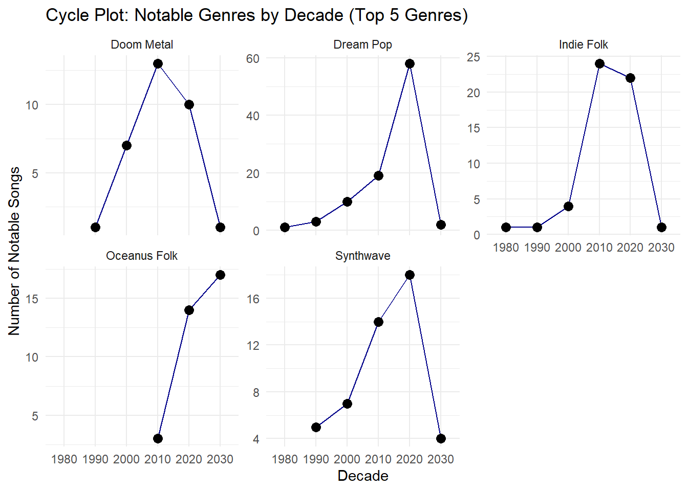
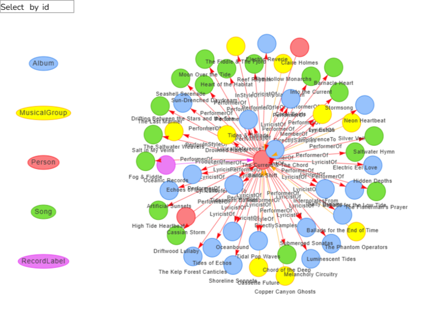
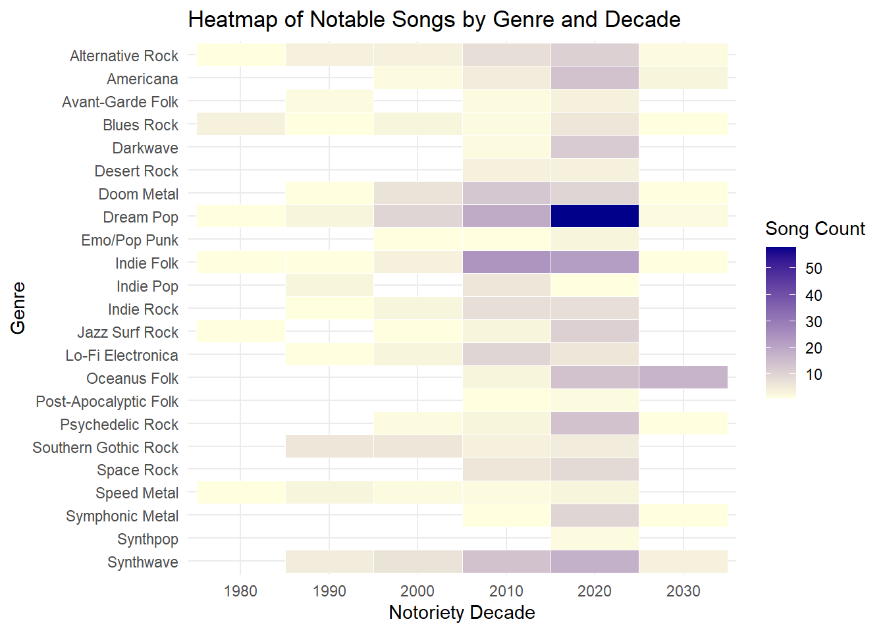

# 📘 Project Overview

This report presents a prototype of a **Story Mode Shiny application** designed to explore the rise of Oceanus Folk music through the lens of Sailor Shift’s career. Instead of relying on traditional multi-tab navigation, the app adopts a **scrolling linear structure** that simulates a feature article—perfect for the app’s core user: journalist **Silas Reed**.

The application is divided into **six narrative sections**, integrating interactive components that allow exploration of musical influence, career timelines, genre evolution, artist comparisons, and predictions.

# 🌐 Application Architecture

The application follows a **narrative scroll-based UI** using `shiny::fluidPage()` sections, `shinyjs::toggle()` for transitions, and optionally, `shiny.router` or `shiny.fluent` for modular routing.

| Section | Title | Role in Narrative |
|------------------------|------------------------|------------------------|
| Intro | Sailor’s Origin | Sets the context: Oceanus Folk roots and Sailor’s beginnings |
| 1 | Timeline of a Superstar | Career trajectory, Ivy Echoes, and major solo milestones |
| 2 | Collaboration Web | Interactive influence graph: Sailor’s musical network |
| 3 | Echoes Across Genres | How Oceanus Folk spread and transformed post-Sailor |
| 4 | Artist DNA Lab | Compare rising stars and Sailor’s growth profile |
| 5 | Forecasting the Future | Predicting next-generation Oceanus Folk stars |

Navigation is controlled via scroll or **“Up** ↑**” “Down ↓” buttons** between sections.

# 📦 R Packages Used

All R packages used were validated to be available on CRAN.

| Package          | Use Case                                  |
|------------------|-------------------------------------------|
| `shiny`          | UI framework                              |
| `shinyjs`        | Show/hide sections dynamically            |
| `plotly`         | Timeline charts, radar charts, area plots |
| `visNetwork`     | Influence/collaboration networks          |
| `dplyr`, `tidyr` | Data wrangling and reshaping              |
| `fmsb`           | Radar charts for artist comparison        |
| `ggplot2`        | Area charts for genre spread              |
| `DT`             | Collaborator data table                   |
| `lubridate`      | Date handling for timelines               |

# 🧪 Key UI Components & Parameters

| Section | Input / Output | Component Type | Description |
|------------------|------------------|------------------|------------------|
| 1 | `selectInput("artist")` | Artist selector | Choose Sailor or her bandmates |
| 1 | `plotlyOutput("timeline")` | Career timeline | Plots albums, viral hits, and key events |
| 2 | `visNetworkOutput("collab")` | Influence network | Visualize direct/indirect collaborations |
| 2 | `sliderInput("depth")` | Network depth | Choose 1–3 hops of influence |
| 3 | `plotOutput("genreArea")` | Genre spread area plot | Shows Oceanus Folk’s rising influence |
| 3 | `renderPlot("chord")` | Genre-to-genre flow | Chord diagram: inspiration ↔ influence |
| 4 | `pickerInput("compareArtists")` | Compare up to 3 | Choose artists to compare growth trajectories |
| 4 | `plotlyOutput("radar")` | Radar chart | Traits: collabs, reach, output, genre diversity |
| 5 | `tableOutput("prediction")` | Prediction engine | Forecast 3 next stars + reasoning |

# 🖼️ UI Sketch

[View the full UI Design (Sketch and Layout) (PDF)](UI Design (Sketch and Layout).pdf)

# 🖌️ UI Design Principles

-   **Narrative Layout**: Scrollable single-page interface with linear section transitions

-   **Minimalist Styling**: Flat layout with Oceanus-inspired colors (e.g., teal, midnight blue)

-   **Consistent Filters**: Artist and year range selectors persist throughout

-   **Interactive Focus**: Users can click, hover, and explore without needing to “navigate”

# 🧵 Data Preparation

-   **Entities**: Artists, genres, albums, songs, record labels

-   **Relationships**: Influences, collaborations, genre alignment

-   **Derived Fields**:

    -   Influence score by artist (based on degree centrality)

    -   Genre evolution index (Oceanus Folk % over time)

    -   Artist trait matrix: collaborations, output, genre reach

# 📊 Visualisation Design Rationale

| Visualization | Used For | Reason |
|------------------------|------------------------|------------------------|
| Timeline Chart | Career progression | Shows how Sailor evolved, contextualized over time |
| visNetwork Graph | Collaboration & influence networks | Visualizes both direct and indirect musical links |
| Heat map | Genre rise and fall | Emphasizes Oceanus Folk’s global impact over time |
| Radar Chart | Artist comparison | Profile rising stars using multiple metrics |
| Table | Predictions with justification | Shows forecasted next stars in an easy-to-digest format |

# 🔧 Code Snippet Examples (Tested)

## 📈 Timeline Chart

```{r}
#| code-fold: true
#| eval: false
ggplot(notoriety_by_decade, aes(x = factor(notoriety_decade), y = n, group = genre)) +
  geom_line(color = "darkblue") +
  geom_point(size = 3) +
  facet_wrap(~ genre, scales = "free_y") +
  labs(
    title = "Cycle Plot: Notable Genres by Decade (Top 5 Genres)",
    x = "Decade",
    y = "Number of Notable Songs"
  ) +
  theme_minimal()
```



## 🌐 Collaboration Network

```{r}
#| code-fold: true
#| eval: false
# Function to create visNetwork graph for a given artist
create_artist_graph <- function(artist_name) {
  # Get artist node ID
  artist_node <- nodes_tbl %>%
    filter(name == artist_name | stage_name == artist_name)
  
  if (nrow(artist_node) == 0) {
    stop(paste("Artist", artist_name, "not found in nodes."))
  }
  
  artist_id <- artist_node$id[1]
  
  # Get all edges connected to artist (source or target)
  connected_edges <- edges_tbl %>%
    filter(source == artist_id | target == artist_id)
  
  # Get all unique node IDs involved in those edges
  related_ids <- unique(c(connected_edges$source, connected_edges$target))
  
  # Filter nodes and edges
  filtered_nodes <- nodes_tbl %>%
    filter(id %in% related_ids) %>%
    mutate(label = name,
           group = node_type,
           title = paste0("<b>", name, "</b><br>", node_type),
           id = as.character(id)) # Ensure ID is character
  
  filtered_edges <- connected_edges %>%
    mutate(from = as.character(source),
           to = as.character(target),
           label = edge_type,
           arrows = "to") %>%
    select(from, to, label, arrows)
  
  # Create visNetwork graph
  visNetwork(filtered_nodes, filtered_edges, height = "600px", width = "100%") %>%
    visEdges(smooth = TRUE) %>%
    visOptions(highlightNearest = TRUE, nodesIdSelection = TRUE) %>%
    visLegend() %>%
    visLayout(randomSeed = 123) %>%
    visPhysics(stabilization = TRUE) %>%
    visExport()
}
```



## 📊 Heat map

```{r}
#| code-fold: true
#| eval: false
ggplot(genre_notoriety_heatmap, aes(x = factor(notoriety_decade), y = fct_rev(genre), fill = n)) +
  geom_tile(color = "white") +
  scale_fill_gradient(low = "lightyellow", high = "darkblue") +
  labs(
    title = "Heatmap of Notable Songs by Genre and Decade",
    x = "Notoriety Decade",
    y = "Genre",
    fill = "Song Count"
  ) +
  theme_minimal()
```



# ✅ Outcome

This Story Mode Shiny prototype offers a narrative-first interface that aligns with the needs of a journalist user. Instead of separating tasks rigidly, it tells a coherent story about:

-   The evolution of Sailor Shift and her collaborators

-   The transformation and global impact of Oceanus Folk

-   The defining traits of rising stars and what comes next

By structuring the dashboard as a **scrollable data story**, the app goes beyond analysis to become an engaging editorial companion.
